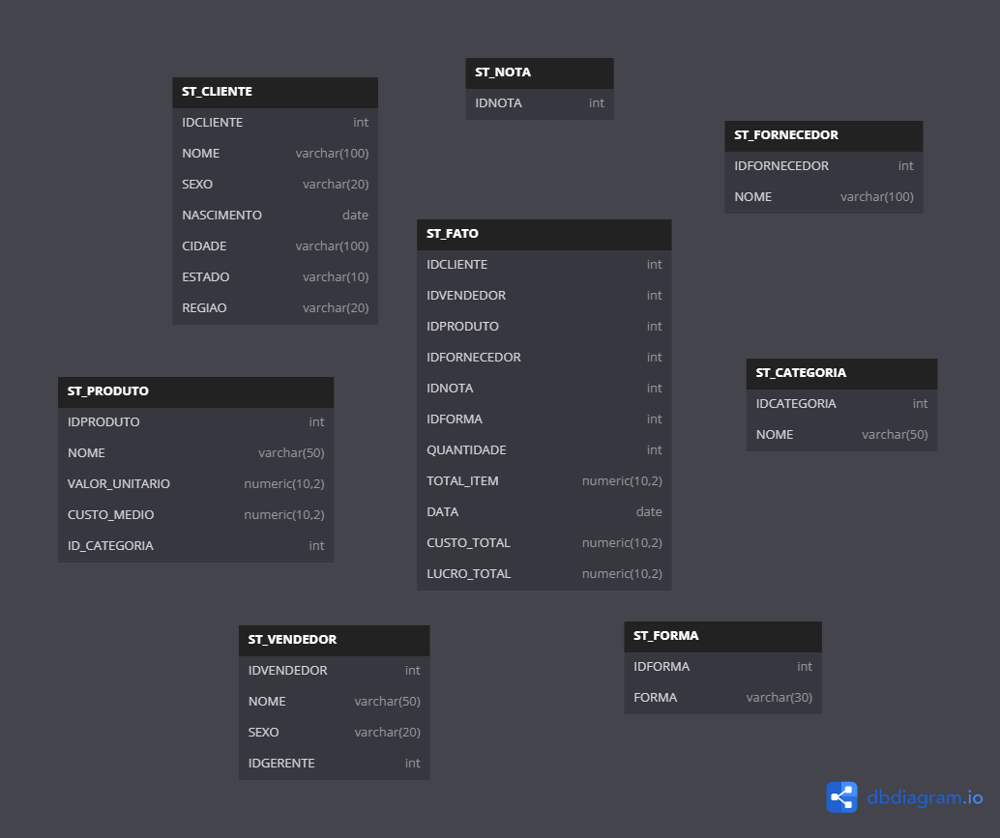
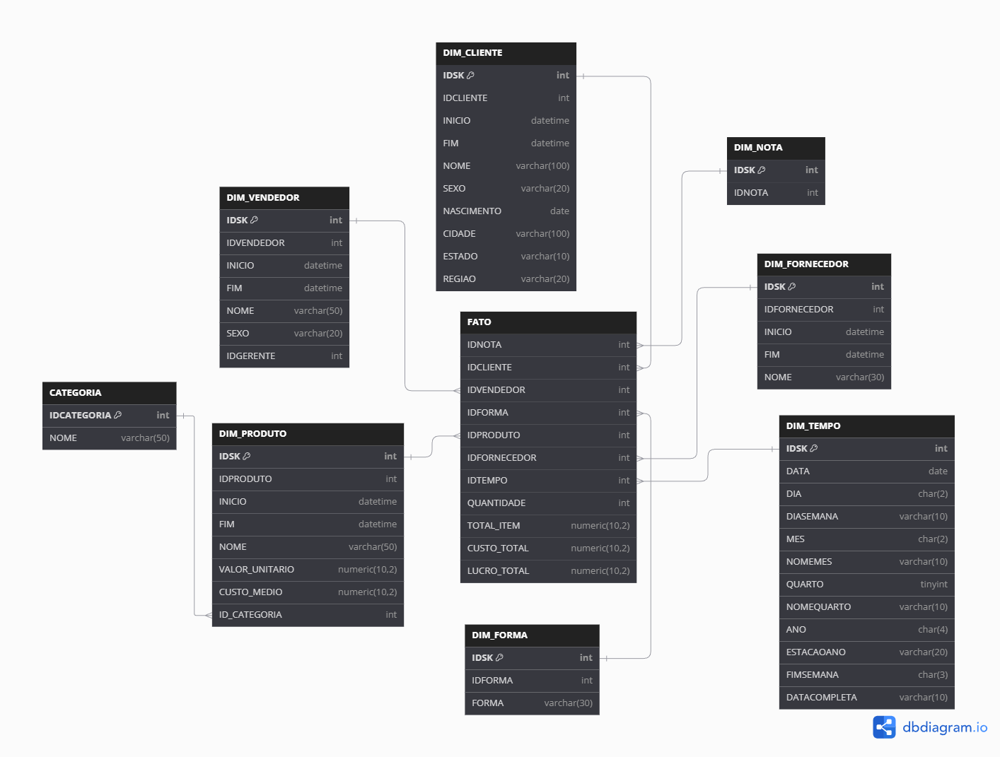
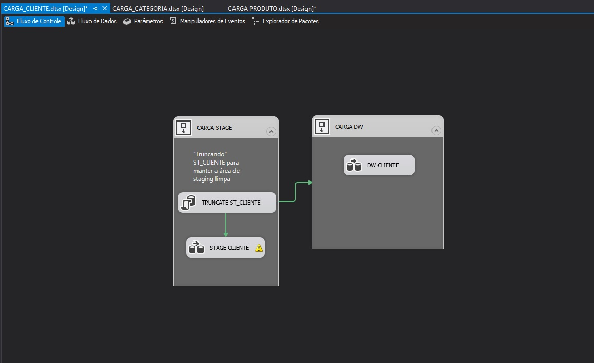
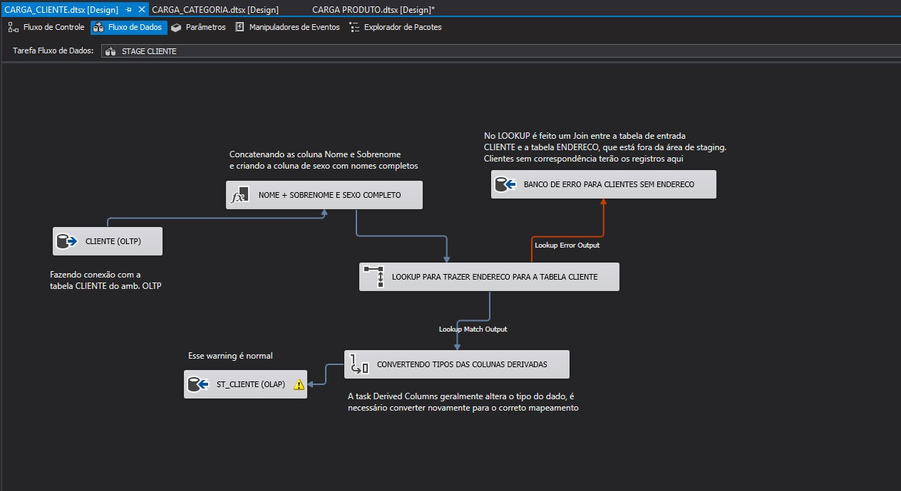
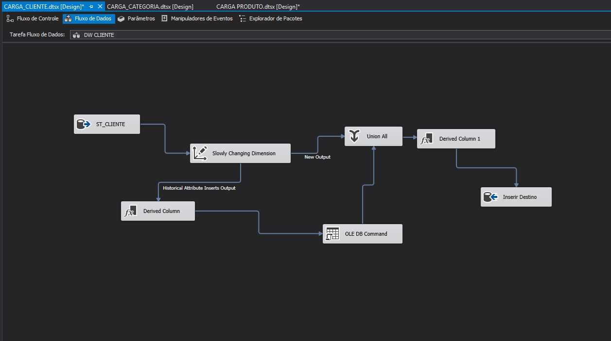

# Projeto realizado no curso completo de BI do Felipe Mafra

Link do curso: [Curso completo de BI](https://www.udemy.com/course/curso-completo-business-intelligence/?couponCode=OF83024E)

## Escopo

Este projeto trata-se da situação hipotética de uma empresa do ramo de Vendas, onde o **escopo foi a criação dos ambientes OLTP, OLAP e staging, além dos pacotes ETL do Integration Services**.

Os arquivos deste repositório são:

**1.** Scripts DDL das áreas de staging e do dw. (DDL_DW.sql e DDL_STAGING.sql)

**2.** Modelos lógicos (diagramas) das áreas de staging e do dw, com arquitetura Snowflake. (imagens_modelos)

**3.** Script de consulta da tabela Categoria do OLTP, pois esta é normalizada com a dimensão Produto do dw. (DW_consulta_categoria.sql)

**4.** Procedure que faz o tratamento dos dados de uma coluna de texto, convertendo os valores para CamelCase. (STG_function_ETL_CamelCase.sql)

**5.** View do abiente OLTP que reflete a estrutura da tabela fato da área de staging. (STG_view_OLTP_fato.sql)

**A pasta 'scripts_fornecidos' contém arquivos de autoria do professor**. Os demais arquivos foram desenvolvidos por mim, durante o acompanhamento das atividades.

Fiz este curso com a intenção de experienciar o desenvolvimento de um projeto de BI
desde a análise dos requisitos até a **modelagem e carga de um data mart (ambiente OLAP)**, passando também pela **modelagem e carga do banco transacional (ambiente OLTP)** e pela **modelagem e carga de um banco de staging**, para que os dados sejam persistidos em um ambiente que não o transacional, evitando assim a sobrecarga do banco de operação com as transformações necessárias. Para o fluxo de dados entre os bancos, foi utilizada a **ferramenta de ETL Integration Services**.

Este curso também abrange a utilização de ferramentas de cubos OLAP (Analysis Services) e de relatórios (Reporting Services). No entanto, para otimizar o tempo dos meus estudos, optei por ir até a finalização da carga do data mart, pois hoje o que mais se vê no mercado é a utilização do Power BI direto com o data mart, sem a camada semântica fornecida pela ferramenta de cubos.

## Ferramentas utilizadas

**Bancos de dados (OLAP, OLTP e Staging)**: SQLServer 2017

**ETL**: SQLServer Data Tools (SSDT) 2015, com foco no Integration Services

**Modelagem de Banco de Dados**: https://dbdiagram.io/home 

## Área de staging

## Data Mart (Arquitetura Snowflake)

## Imagens do processo de ETL (Integration Services)

### 1. ETL completo para a carga da dimensão cliente, com organização dos fluxos em contêineres de sequência.

### 2. Data Flow Task para o ETL do ambiente OLTP para a área de staging.

Aqui foi feita uma transformação com o **componente de coluna derivada** para criar uma coluna que concatena nome e sobrenome do cliente. Também foi realizado um **lookup** na tabela ENDERECO, pois a dimensão cliente precisa conter o endereço do cliente, e não há uma dimensão de endereço neste projeto. Para os casos em que não há interseção entre os dois conjuntos/tabelas, foi criado um fluxo alternativo em um Banco de Dados separado. Por fim, é realizada a **conversão dos tipos** de dados para padronizar tudo e evitar exceções.

### 3. Data Flow Task para o ETL do ambiente de staging para o data warehouse (data mart pra ser mais específico).

Utilização do **componente de Slow Changing Dimension (SCD)** para armazenar o registro histórico das mudanças nos registros dos clientes. Para a correta configuração do componente, a dimensão possui uma **chave substituta** (que atua como se fosse a chave primária em dw's), a **chave do negócio** (chave primária do OLTP) e as **colunas fim e início**, para controlar a vigência do registro.

